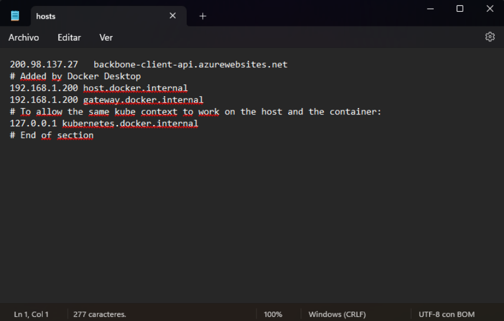
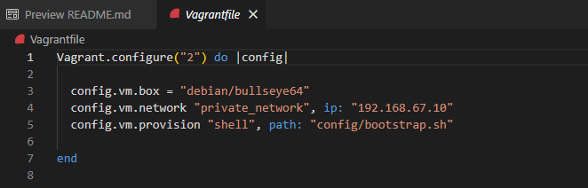
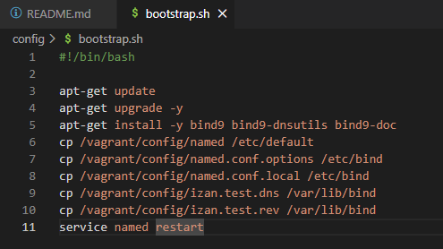
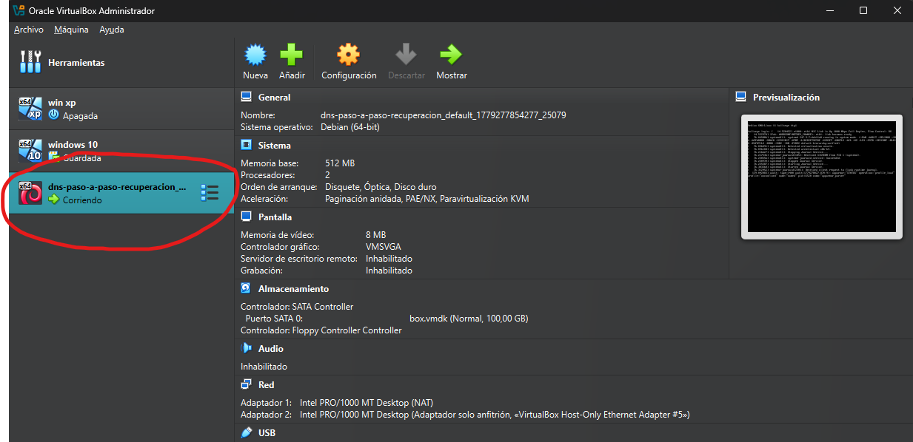
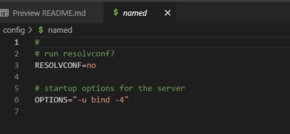
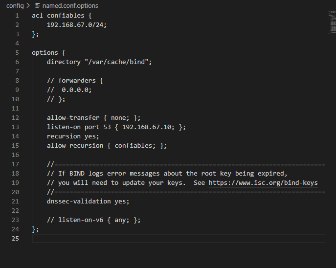
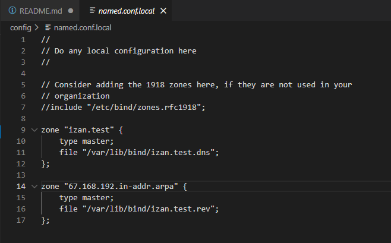
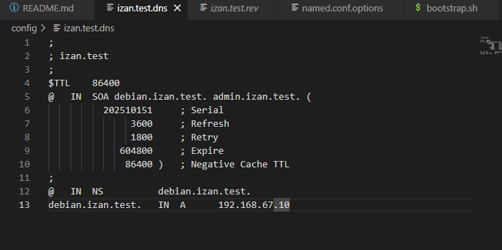
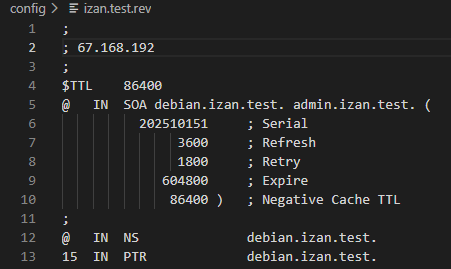
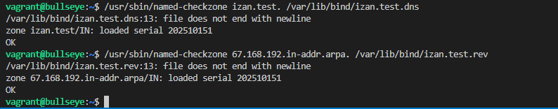

# PASO 1: Borrar las entradas de hosts
Para ello (cliente con Windows 11), lo que hay que hacer es:
1. En nuestro explorador de archivos, iremos a C:\Windows\System32\drivers\etc para editar nuestro archivo "hosts"
2. Abrimos el bloc de notas como administrador, abrimos el archivo "hosts" buscándolo con el explorador de archivos 
y borramos las líneas posiblemente relacionadas. Como no tengo que borrar nada, lo dejaré como está. En el caso de
haber editado el archivo, lo guardamos.

---
# PASO 2: Crear los archivos Vagrantfile y bootstrap.sh
Para esto, iremos al VSCode (Visual Studio Code), y crearemos dos archivos: Vagrantfile y bootstrap.sh
Lo que pondremos en estos archivos será lo siguiente:

+ Para el archivo Vagrantfile (que nos creará la máquina virtual), lo siguiente:

+ Y para el archivo bootstrap.sh (que nos ayudará a "configurar un poco" la máquina virtual), esto:

Por el momento el archivo bootstrap.sh se quedará así, ya que más adelante lo iremos editando para ajustarlo al seguimiento de esta práctica. Hay que tener en cuenta que estos dos archivos se ubican en la carpeta config.

Una vez que tenemos todo eso, en la consola de VSCode, escribiremos `vagrant up` (antes de esto, sí o sí hay que tener instalado vagrant en el cliente), y nos creará la máquina virtual en VBox. La que tengo seleccionada es la que me ha creado el Vagrantfile.

---
# PASO 3: Instalar el servidor DNS
Una vez que estemos dentro de la máquina virtual (para acceder el usuario es root y la contraseña vagrant), en el caso de no tener instalados los servicios de bind9, los instalaremos ejecutando este comando:

`apt install bind9 bind9utils bind9-doc` (no hacemos sudo porque hemos iniciado sesión como root)

Y ya lo tendríamos.

---
# PASO 4: Configurar el servidor DNS
Como solamente vamos a trabajar con IPv4, se lo diremos al Bind escribiéndolo en el archivo /etc/default/named haciendo `nano /etc/default/named`

Y ya a partir de ahí, empezaremos configurando el archivo named.conf.options (haremos `nano /etc/bind/named.conf.options`)
Primero, creamos un backup (con `cp /etc/bind/named.conf.options /etc/bind/named.conf.options.backup`), y después metemos lo siguiente en el archivo:

Más adelante, tendremos que editar el archivo named.conf.local. Así que haremos eso (`nano /etc/bind/named.conf.local`) y meteremos la siguiente configuración:

Ahora, configuraremos los archivos izan.test.dns e izan.test.rev (en vez de poner tunombre, pongo mi nombre: Izan). Como no existen, también los podemos crear haciendo `nano /var/lib/bind/izan.test.dns` y `nano /var/lib/bind/izan.test.rev`
Los archivos quedarían tal que así:

---
# PASO 5: Revisar la configuración del servidor DNS
Ya que hemos configurado nuestro servidor, ahora toca revisar si todo está bien. Para ello, pondremos los siguientes comandos:
`named-checkzone izan.test. /var/lib/bind/izan.test.dns`  
`named-checkzone 8.168.192.in-addr.arpa. /var/lib/bind/izan.test.rev`

Comprobamos que todo está bien...
  
...Y efectivamente, nos da OK en ambos archivos, por lo que la configuración es correcta. Ahora, reiniciamos el servicio y al hacer `service bind9 status` buscamos una línea que nos confirme todo.

---
---

# PREGUNTAS FINALES:

1. ¿Qué pasará si un cliente de una red diferente intenta usar tu DNS?
+ Probablemente no funcionará para consultas recursivas si tu allow-recursion limita a la ACL confiables. Si tu listen-on está en la IP pública o el firewall permite acceso, podrían consultar solo si no restringes. (Revisa allow-recursion y listen-on en named.conf.options). 
2. ¿Por qué tenemos que permitir las consultas recursivas?
+ Para que tu DNS pueda resolver nombres que no conoce preguntando a otros servidores (hacer la búsqueda completa por el cliente). Si no permites recursión, solo responde por zonas autoritativas.
3. ¿El servidor DNS que acabas de montar es autoritativo? ¿Por qué?
+ Sí, es autoritativo para las zonas que declaraste como type master en named.conf.local (p. ej. tunombre.test), porque guarda los datos de la zona.
4. ¿Dónde podemos encontrar la directiva $ORIGIN y para qué sirve?
+ $ORIGIN aparece en archivos de zona para fijar el sufijo por defecto en los registros. Se usa en los ficheros de zona (archivo .dns) para no repetir el dominio completo en cada registro.
5. ¿Una zona es igual a un dominio?
+ No exactamente: una zona es la porción del espacio de nombres que un servidor administra. Un dominio puede corresponder a una zona, pero una zona puede dividirse (subzonas) o existir varias zonas delegadas.
6. ¿Cuántos servidores raíz existen?
+ Hay 13 conjuntos de servidores raíz (letras A–M), aunque físicamente existen muchísimos servidores distribuidos por todo el mundo detrás de esas 13 referencias.
7. ¿Qué es una consulta iterativa de referencia?
+ Es cuando un resolver pide a un servidor DNS que le diga quién es el siguiente servidor a preguntar (p.ej. pide referencias a servidores de nivel superior) hasta llegar al autoritativo.
8. En una resolución inversa, ¿a qué nombre se mapearía la dirección IP 172.16.34.56?
+ Se mapearía usando el dominio inverso 56.34.16.172.in-addr.arpa, y en el archivo de zona inversa se define un PTR que apunta al nombre del host correspondiente.